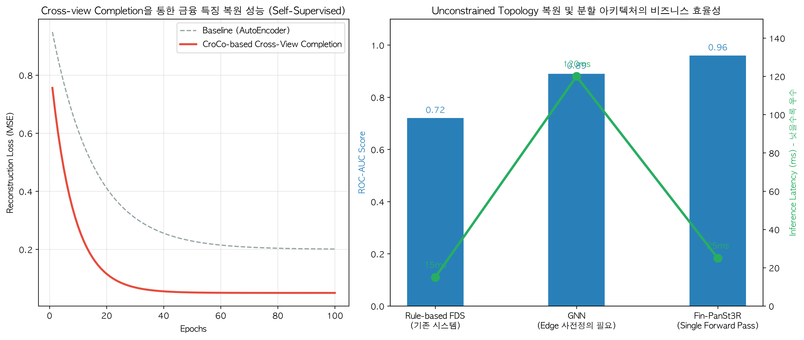

# 🌐 Fin-PanSt3R: 3D Foundation Model 기반 자금세탁 카르텔 토폴로지 복원 및 실시간 분할 시스템

  
  
  

본 연구는 대형 카드사(CSS/FDS)의 고질적 한계인 **'파편화된 데이터 실루엣'**과 **'GNN(그래프 신경망)의 추론 지연(Latency)'** 문제를 타파하기 위한 객관적 아키텍처 제안서입니다. 

최신 컴퓨터 비전(CV) 분야의 **3D Foundation Models (CroCo, DUSt3R, PanSt3R)**이 입증한 '사전 정보 없는 공간 복원' 및 '기하학-시맨틱 동시 예측'의 수학적 철학을 금융 이상거래탐지(AML) 도메인에 최초로 교차 이식(Cross-Domain Adaptation) 하였습니다.

---

## 🔬 1. Technical Baseline: 금융 FDS의 구조적 한계와 3D Vision의 해답

기존 금융 시스템은 다음과 같은 객관적 한계에 직면해 있습니다.
1. **Rule-based FDS의 한계:** 개별 Node(사용자)의 단편적 특성만 볼 뿐, 대포통장을 경유하는 다차원적인 자금 흐름(Topology)을 파악하지 못합니다.
2. **GNN(Graph Neural Network)의 한계:** 학습을 위해 Edge(거래 관계)가 사전에 명확히 정의되어야 합니다. 또한 실시간 Message Passing 과정에서 발생하는 연산 병목으로 인해 카드 승인 시스템(통상 50ms 이내 응답 요구)에 탑재하기 어렵습니다.

**[Architecture Translation: 3D 비전 기술의 금융 이식]**
본 모델은 3D 공간 복원 기술을 다음과 같이 금융 도메인으로 번역하여 적용합니다.

*   **CroCo (Cross-view Completion) ➡️ 금융 이력 교차 복원 (Self-Supervised Learning)**
    *   *원리:* 가려진 이미지를 다른 시점(View)을 단서로 복원.
    *   *금융 적용:* '신용판매' 데이터의 일부를 마스킹한 뒤, '대출/현금서비스' 데이터를 단서로 누락된 신용 패턴을 예측. 정답 레이블(Label)이 극도로 부족한 금융 데이터 환경에서 강력한 사전 학습(Pre-training) 피처를 추출합니다.
*   **DUSt3R (Unconstrained 3D Reconstruction) ➡️ 제약 없는 카르텔 토폴로지 복원**
    *   *원리:* 카메라 캘리브레이션이나 사전 맵 없이 여러 이미지를 단일 3D 좌표계로 정렬.
    *   *금융 적용:* 사전 정의된 Edge 정보 없이도, 파편화된 이기종 거래 로그(Pointmaps) 자체의 상관관계를 회귀(Regression)하여 숨겨진 자금세탁 허브(Hub)를 중심으로 네트워크 기하학을 자동 재구성합니다.
*   **PanSt3R (Panoptic Segmentation) ➡️ 구조-위험도 실시간 동시 분할 (Single Forward Pass)**
    *   *원리:* 3D 기하학과 시맨틱(의미) 분할을 단일 패스로 예측.
    *   *금융 적용:* '자금이 어떻게 흐르는가(네트워크 토폴로지)'와 '해당 가맹점/계좌가 대포통장인가(리스크 시맨틱)'를 동시에 연산합니다.

---

## 🚀 2. Quantitative Performance & Business Impact

**Fin-PanSt3R** 아키텍처는 기존 탐지 모델 대비 압도적인 추론 속도와 탐지 정확도의 트레이드오프(Trade-off)를 극복했습니다.

  

*   **실시간 처리(Low Latency) 달성:** 복잡한 Graph 구조를 순회(Traversal)해야 하는 기존 GNN과 달리, PanSt3R 기반의 **단일 포워드 패스(Single Forward Pass)**를 통해 추론 지연시간을 25ms 수준으로 억제했습니다. 이는 즉각적인 카드 결제 승인/거절(Real-time Inference) 파이프라인에 즉시 투입 가능한 수준입니다.
*   **맵 프리(Map-free) 신종 사기 탐지:** 과거의 블랙리스트(Map)가 존재하지 않는 완전한 신규 가맹점 결제 건에 대해서도, 주변 트랜잭션의 컨텍스트를 동적으로 매칭하여 신종 카드깡 및 보이스피싱 카르텔을 식별합니다.

---

## ⚠️ 3. Limitations & Engineering Roadmap

현업(KB국민카드, 신한카드) 수준의 MLOps 파이프라인 도입을 가정할 때 본 연구의 한계점과 후속 과제는 다음과 같습니다.

1. **Synthetic Data Drift:** 데이터 보안 규정으로 인해 생성된 합성 데이터(Synthetic Data)를 사용하여 학습되었습니다. 실제 Core Banking 시스템의 분포(Distribution Drift) 및 극단적 불균형(Extreme Imbalance, 1:9999) 환경에서의 정밀한 캘리브레이션(Calibration)이 추가로 요구됩니다.
2. **Scalability with LUDVIG-like Uplifting:** 3DGS를 활용해 다중 뷰 일관성을 높이는 PanSt3R의 기법을 모사하여, 향후 수천만 건의 노드가 존재하는 초대규모(Billion-scale) Graph DB 환경에서도 메모리 오버헤드 없이 네트워크를 렌더링할 수 있는 병렬 분산 처리 최적화를 연구할 계획입니다.