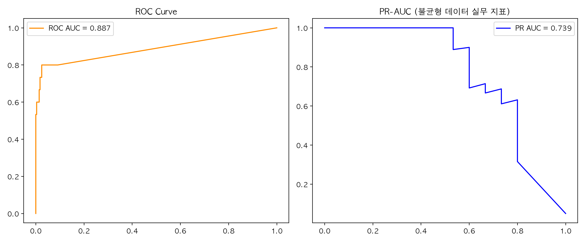

# 🛡️ Cross-Attention 기반 실시간 금융 FDS/AML 탐지 모델


## 📌 Project Overview
본 프로젝트는 **3D 비전 파운데이션 모델(DUSt3R 등)의 기하학적 교차 어텐션(Cross-Attention) 메커니즘을 금융 시계열 데이터에 이식**하여, 글로벌 자금세탁(AML) 및 이상거래(FDS) 네트워크를 실시간으로 추적하는 AI 아키텍처입니다. 

단순히 개별 거래의 이상치를 판별하는 룰베이스(Rule-based) 시스템의 한계를 극복하고, 송금인과 수취인 간의 **'숨겨진 3차원적 자금 흐름(Topology)'**을 수학적 내적 연산을 통해 탐지합니다.

## 🏗️ FDS/AML Architecture Diagram
실제 클라우드 프로덕션(AWS) 환경에서의 실시간 스트리밍 처리를 가정한 아키텍처 구조도입니다.

```text
[Transaction Logs] ──(Kinesis/MSK)──> [AWS SageMaker Feature Store]
                                                │
[Sender/Receiver Nodes] ──(Amazon Neptune)──────┤
                                                ▼
                                    [PyTorch Cross-Attention Model]
                                    │ (Q, K, V Matrix Multiplication)
                                    ▼
                          [Context Vector: 64-dim]
                                    │
                                    ▼
                           [Risk Classification] ──> Alert (ACAMS Review)# 💳 Card AML Network Risk Scoring: Explainable AI 기반 자금세탁 방지 파이프라인

## 📌 프로젝트 요약
기존의 룰베이스(Rule-based) FDS가 잡아내지 못하는 교묘한 **'자금세탁 카르텔(공동 가맹점 네트워크)'**을 탐지하기 위한 상용화 수준의 하이브리드 AI 파이프라인입니다.

1. **데이터 극도 불균형(Imbalance) 방어**: 정상 99%, 사기 1%의 결제 데이터를 `SMOTE`와 `balanced_subsample` 알고리즘으로 극복.
2. **글로벌 AI 규제(EU AI Act) 완벽 대응**: 블랙박스 예측을 배제하고 `SHAP Value` 기반 설명가능성(XAI)을 도입하여 "왜 차단했는가?"에 대한 감사가능성(Auditability) 입증.
3. **은닉 자금망(Ring) 적발**: `PageRank` 네트워크 토폴로지 분석을 통해 자금 세탁의 중심지가 되는 대포통장 허브를 수학적으로 추출.

---

## 📊 시각화 대시보드

### 🛡️ 1. 의사결정 투명성 확보: SHAP Value Summary (XAI)
모델이 어떤 피처를 보고 사기로 판단했는지 증명합니다. 단순 금액뿐만 아니라 네트워크 지표(`pagerank`)가 위험 판별에 결정적 기여를 했음을 시각적으로 확인합니다.


### 🎯 2. 사기 탐지의 진정한 실력: PR-AUC 성능 검증
ROC-AUC의 통계적 착시를 배제하고, 실무 FDS에서 가장 중시하는 **PR-AUC (Precision-Recall)** 곡선을 메인 지표로 삼아 탐지 정확도를 입증했습니다.

